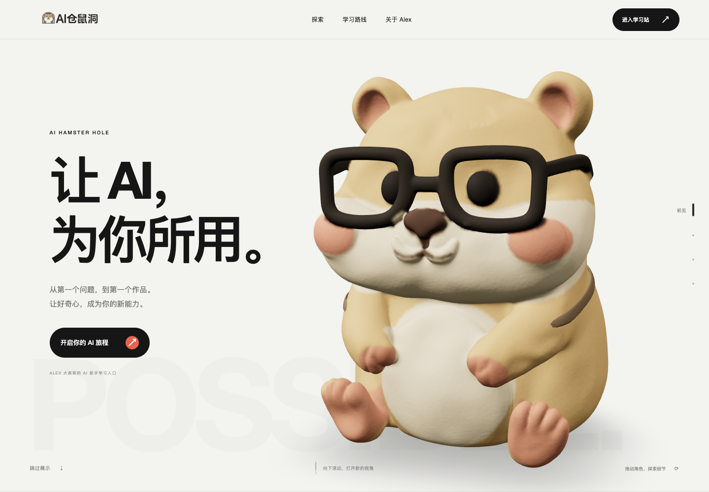

# AI Hamster Hole · Seated Clay Refinement V4

Alex's learning gateway for AI beginners. V4 refines the user's uploaded seated hamster GLB, repairs the crown and surface, adds a separate small backpack, and adapts the four promotional camera chapters to the clay sculpture. Learning routes continue to the [AI Hamster Hole learning site](https://ai.alexdbg.com/). The website UI is Chinese.

[简体中文](README.md) · [Live website](https://dikemanarndellst703-star.github.io/sen-3d-resume/) · [V4 refinement report](https://dikemanarndellst703-star.github.io/sen-3d-resume/update-report-v4/) · [V3 historical report](https://dikemanarndellst703-star.github.io/sen-3d-resume/update-report-v3/) · [V2 historical report](https://dikemanarndellst703-star.github.io/sen-3d-resume/update-report/) · [Model statistics](docs/redesign-v4-clay-2026-09-08/model-stats.json)



## What changed

- **Refine the uploaded mesh.** `tripo_convert_bfa920ab-ad7b-44e1-b2ac-2ceb65744036.glb` is byte-identical to the preserved `web/public/models/ai-hamster.glb`: 501,070 triangles and 16,039,824 bytes. The seated pose, hands held before the belly, forward-facing feet, broad cheeks and dark square glasses remain. The original file is unchanged; see [provenance.json](docs/redesign-v4-clay-2026-09-08/provenance.json).
- **Repair shape and color.** Remove the fused crayfish and repair its contact area into a continuous rounded crown while protecting the ears. Clean scanned bumps and irregular edges. Source coordinates and sampled color jointly preserve separate gold, cream face/belly, blush, inner-ear/paw, glasses/eye and nose regions. Lips remain cream with a thin dark-brown mouth groove; baked lighting and highlight patches are removed.
- **Matte handmade clay.** Restrained impressions and a soft matte surface replace the previous furry treatment. A separate small backpack and straps add rear-view structure. The website loads the full-detail export; actual triangle count, file size, material count and SHA-256 are recorded in [model-stats.json](docs/redesign-v4-clay-2026-09-08/model-stats.json).
- **Four chapters adapted to the seated sculpture.** Silver full-body view, dark face close-up, backpack orbit and full-scene ending. Native scrolling drives camera, background and copy. Chapter jumps, whole-character dragging and touch/keyboard rotation remain available.
- **Render on demand.** This is a fused sculpture without independent head, eye or arm joints. Scrolling and explicit interaction request frames; the stable scene stops issuing new WebGL draws. Off-screen and hidden-tab rendering pauses. Loading includes a model poster and progress, with failure fallback and live reduced-motion support.
- **Keep the learning content.** Four routes use full-screen horizontal chapters on desktop and natural vertical flow on phones, short screens and reduced-motion mode. All 16 course links, five experience entries and 15 supporting points remain.

The full GLB and final triangulated Blender model each contain **1,025,000 real triangles**. The GLB is **29,364,716 bytes**; the final Blender has **512,688 vertices**. The editable master has **994,602 polygons / 1,025,000 triangles** and uses mixed topology, not an all-quad mesh. The body contributes 965,700 triangles and the separate backpack 59,300, across five meshes and 11 materials with no bitmap textures. Material-boundary splits produce 518,667 total GLB POSITION vertices; see the [independent binary verification](docs/redesign-v4-clay-2026-09-08/model-asset-verification.json) and [model statistics](docs/redesign-v4-clay-2026-09-08/model-stats.json). More geometry or a larger file does not imply higher frame rates, faster loading or better conversion.

Frozen GLB SHA-256: `e3c5eeb1fa3534707fa45cf74848b2dea20f3997be894bfc787e3a2ceb548c76`.

## Run locally

Use Node `^20.19.0 || ^22.13.0 || >=24`; CI uses Node 20. Run npm commands inside `web/`:

```sh
cd web
npm ci
npm run dev
npm run typecheck
npm run lint
npm run build
npm run preview
```

Output is `web/dist/`, including separate V2, V3 and V4 reports. This is a static front-end SPA without a backend, database or API keys.

## Maintenance map

| Area | Repository path |
| --- | --- |
| Navigation, page order and footer | `web/src/App.tsx` |
| Four chapters, loading, fallback and motion preference | `web/src/scene/Cinema.tsx` |
| Full-detail model, lighting, whole-character dragging and demand rendering | `web/src/scene/CinematicWorld.tsx` |
| Camera poses, rotation and chapter timing | `web/src/scene/cinematicTimeline.ts` |
| Original course data | `web/src/data/works.ts` |
| Learning routes and Alex's story | `web/src/ui/FlagshipRoutes.tsx`, `FlagshipAbout.tsx` |
| Typography, layout and transitions | `web/src/styles.css`, `web/src/ui/flagship-sections.css` |

Old `Stage.tsx`, `Scene.tsx`, `Resume.tsx`, `Works.tsx` and tutorials remain as historical sources. The current entry does not import them. V2/V3 blinking and independent head/arm motion are not V4 capabilities.

## Blender delivery

| File | Purpose |
| --- | --- |
| `blender/hamster-v4-clay.blend` | Final triangulated clay model: 1,025,000 polygons |
| `blender/hamster-v4-clay-authoring.blend` | Mixed-topology master: 994,602 polygons / 1,025,000 triangles |
| `blender/refine_hamster_v4_clay.py` | Repair the uploaded geometry, rebuild materials and export |
| `blender/clay_color_regions_v4.py` | Source-space color classification and linear palette |
| `blender/clay_backpack_v4.py` | Separate seated backpack in the source coordinate frame |
| `blender/verify_hamster_v4.py` | Independent GLB indices/positions and preserved-asset checks |
| `blender/verify_hamster_v4_blender.py` | Reopen final Blender, reimport GLB, check counts and body topology |
| `web/public/models/hamster-v4-clay.glb` | Full-detail browser model |
| `web/public/brand/hamster-v4-clay-poster.png` | Loading and failure fallback poster |

Run from the repository root; replace the executable path as needed:

```sh
/Applications/Blender.app/Contents/MacOS/Blender --background --python blender/refine_hamster_v4_clay.py
python3 blender/verify_hamster_v4.py
/Applications/Blender.app/Contents/MacOS/Blender --background --python blender/verify_hamster_v4_blender.py
```

Use Blender's Python for refinement and Blender reimport checks; the binary GLB verification script uses standard Python. The original source is Z-up and faces +X; export is normalized to glTF Y-up, +Z forward, a floor-level origin and a hamster-body height of about 3.6. `HamsterRoot` controls the whole sculpture; `ClayBackpack` is the separate accessory root. Do not require or invent independent `Head`, `Eye_L/R` or `Arm_L/R` joints. The color helper expects **original source coordinates**; after remeshing, map each sample back to the source before classification rather than passing scaled world coordinates.

## Validation, deployment and history

Run against a production preview from the repository root. The scripts themselves define their supported options:

```sh
SITE_URL=http://127.0.0.1:5175/ node scripts/verify-v4.cjs
SITE_URL=http://127.0.0.1:5175/ node scripts/verify-v4-loading.cjs
SITE_URL=http://127.0.0.1:5175/ node scripts/verify-v4-rotation.cjs
SITE_URL=http://127.0.0.1:5175/ node scripts/verify-v4-report.cjs
SITE_URL=http://127.0.0.1:5175/ node scripts/capture-v4.cjs
```

Chrome/Playwright is required, plus ffmpeg for recordings. `CHROME_PATH` and `PLAYWRIGHT_CORE` can override local paths. Checks cover stable-scene draw inactivity, resuming on interaction, chapters and reverse scrolling, dragging, native touch scrolling, reduced motion and failure fallback. Evidence and real screenshots/video live in the [V4 report directory](docs/redesign-v4-clay-2026-09-08/); pending checks are not passes.

The [GitHub Pages workflow](.github/workflows/deploy.yml) builds and deploys pushes to `main`. Preserve `base: './'` and `import.meta.env.BASE_URL` for repository subpaths. Report output paths are `/update-report/` for V2, `/update-report-v3/` for V3 and `/update-report-v4/` for V4. The final commit, `v4.0.0` tag and deployment evidence belong in the [release notes](docs/redesign-v4-clay-2026-09-08/release-notes.md); Actions records and the actual live page establish publication status.

V1–V3 source assets, models, reports, screenshots and recordings are preserved. V3 is anchored at `v3.0.0` / `c8784bc`; historical tags `v1-before-3d-redesign-20260908`, `v2.0.0` and `v3.0.0` are not overwritten.

## Attribution and rights

This project builds on Sen Zheng (SEN)'s [sen-3d-resume](https://github.com/dayinji/sen-3d-resume), retaining [LICENSE](LICENSE) and [NOTICE](NOTICE). Source code is MIT-licensed; the original author's name, likeness, models, résumé, work content and branding are excluded. User-uploaded character assets and AI Hamster Hole / Alex branding, content and presentation assets are likewise not automatically licensed for reuse by the code's MIT license. Third-party assets retain their own terms.
