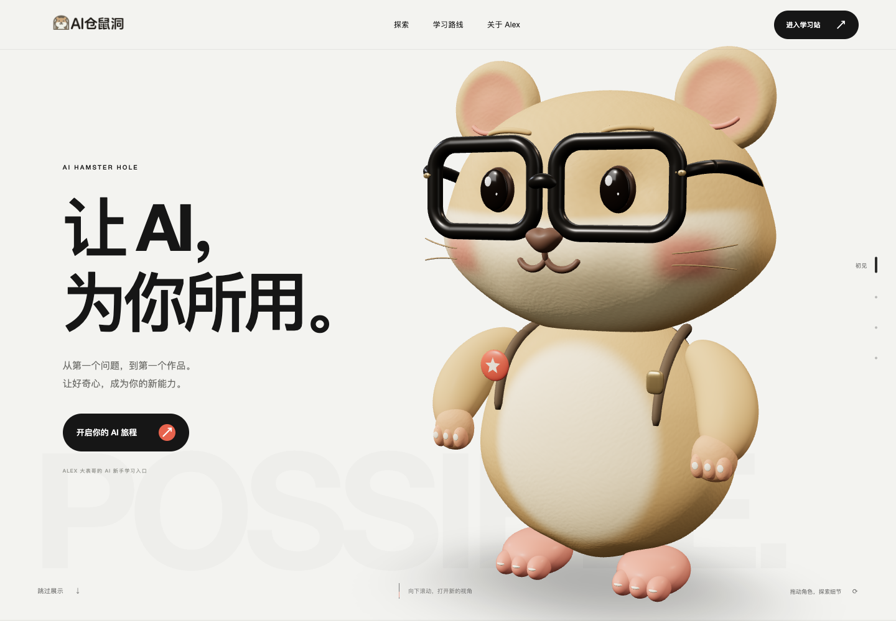

# AI 仓鼠洞 · 旗舰展示 V3

Alex 大表哥的 AI 新手学习入口。百万面仓鼠在银白与深黑之间展开四幕镜头；从认识 AI、观察细节到选择学习路线，最后进入 [AI 仓鼠洞学习站](https://ai.alexdbg.com/)。

[在线体验](https://dikemanarndellst703-star.github.io/sen-3d-resume/) · [V3 对比报告](https://dikemanarndellst703-star.github.io/sen-3d-resume/update-report-v3/) · [V2 历史报告](https://dikemanarndellst703-star.github.io/sen-3d-resume/update-report/) · [模型交付](docs/redesign-v3-2026-09-08/model-delivery.md)



## 本次变化

- Blender 最终模型和网页 GLB 均为 **1,018,268 个真实三角面**。新增浅幅绒感几何、立体耳褶、镜框铰链、鼻口和颊部结构、背包车线、拉链与肩带连接。保留四边形建模母版。
- 原探索舱改为连续摄影：银白全身 → 黑底眼镜与面部近景 → 背包环绕 → 银白收尾。原生纵向滚动驱动镜头、光线和文案，章节按钮可直接跳转。
- 鼠标拖动观察角色；旋转按钮在触屏与键盘上提供同等入口。触摸画布仍可纵向滚动。百万面显示模型与轻量鼠标拾取体分开，避免每次鼠标移动遍历百万三角面。
- 四条学习路线改为整屏横向分镜；移动端、短屏和系统减少动态模式自然纵向展开。保留全部 16 条课程链接、五段经历、15 项要点与原成果数据。
- 首屏正文先显示，3D 独立加载，加载过程有真实模型海报与进度。下载失败或 WebGL 不可用时显示静态海报。离屏及隐藏标签页暂停渲染，减少动态模式停止持续动画。

GLB 为 **26,347,280 字节（25.13 MiB）**，默认加载完整百万面版本。这是为用户要求选择的精度预算；不以增加面数推断帧率或加载速度提升，移动设备与网络性能仍有差异。

## 本地运行

```sh
cd web
npm ci
npm run dev
```

使用 Node `^20.19.0 || ^22.13.0 || >=24`（现有 CI 为 Node 20）。验收命令：

```sh
npm run typecheck
npm run lint
npm run build
npm run preview
```

构建输出 `web/dist/`，同时发布 V2、V3 两份对比报告。页面为纯前端 SPA，无后端、数据库或 API key。

## 维护入口

| 内容 | 仓库内路径 |
| --- | --- |
| 导航、整体顺序与页脚 | `web/src/App.tsx` |
| 四幕文案、加载回退、章节与减少动态 | `web/src/scene/Cinema.tsx` |
| 3D 模型、光线、拖动、眨眼与渲染策略 | `web/src/scene/CinematicWorld.tsx` |
| 镜头关键位置、转角与章节时间 | `web/src/scene/cinematicTimeline.ts` |
| 16 条原始课程数据 | `web/src/data/works.ts` |
| 学习路线与关于 Alex | `web/src/ui/FlagshipRoutes.tsx`、`FlagshipAbout.tsx` |
| 排版与动效 | `web/src/styles.css`、`web/src/ui/flagship-sections.css` |

旧 `Stage.tsx`、`Scene.tsx`、`Resume.tsx`、`Works.tsx` 和教程作为历史来源保留，当前入口不再导入它们。

## Blender 交付

| 文件 | 用途 |
| --- | --- |
| `blender/hamster-v3.blend` | 最终三角化模型，实际 1,018,268 polygons |
| `blender/hamster-v3-authoring.blend` | 可继续编辑的母版，503,769 polygons / 1,018,268 triangles |
| `blender/build_hamster_v3.py` | 原创几何、材质、GLB 与海报生成 |
| `blender/render_hamster_v3_details.py` | 脸部、背包与同机位 V2/V3 对照 |
| `web/public/models/hamster-v3.glb` | 网页完整精度角色 |
| `web/public/brand/hamster-v3-poster.png` | 加载和失败回退海报 |

```sh
/Applications/Blender.app/Contents/MacOS/Blender --background --python blender/build_hamster_v3.py
/Applications/Blender.app/Contents/MacOS/Blender --background --python blender/render_hamster_v3_details.py
/Applications/Blender.app/Contents/MacOS/Blender --background --python blender/verify_hamster_v3_blender.py
python3 blender/verify_hamster_v3.py
```

脚本从仓库根运行，Blender 路径按环境替换。模型为 glTF Y-up、+Z 朝前、地面原点、高约 3.6。稳定节点 `HamsterRoot`、`Head`、`Eye_L/R`、`Arm_L/R`，眼睛 `scale.y` 用于眨眼。详见模型交付说明。

## 验证、部署与历史

真实浏览器验收：`scripts/verify-v3.cjs`；录屏及截图：`scripts/capture-v3.cjs`。支持 `PLAYWRIGHT_CORE`、`CHROME_PATH`、`SITE_URL` 等环境变量，需本机 Chrome 和 ffmpeg。验证结果保存在 [V3 报告目录](docs/redesign-v3-2026-09-08/)。

沿用 [GitHub Pages workflow](.github/workflows/deploy.yml)，推送 `main` 后构建并发布。`base: './'` 与 `import.meta.env.BASE_URL` 支持仓库子路径。最终发布状态以 Actions 记录和在线实际页面为准。

保留 V1 原资产、V2 模型、两份独立旧新报告、真实截图与录屏。版本标签 `v1-before-3d-redesign-20260908`、`v2.0.0`、`v3.0.0` 可定位对应源码；不覆盖旧标签。

## 来源与许可

本项目基于 Sen Zheng（SEN）的 [sen-3d-resume](https://github.com/dayinji/sen-3d-resume) 代码二次开发，保留 [LICENSE](LICENSE) 与 [NOTICE](NOTICE)。代码采用 MIT；原作者姓名、肖像、模型、简历、作品及品牌素材不在 MIT 授权范围内。AI 仓鼠洞 / Alex 的品牌、内容、角色与展示素材也不因代码采用 MIT 而自动获得复用授权。第三方资产遵守各自许可。
