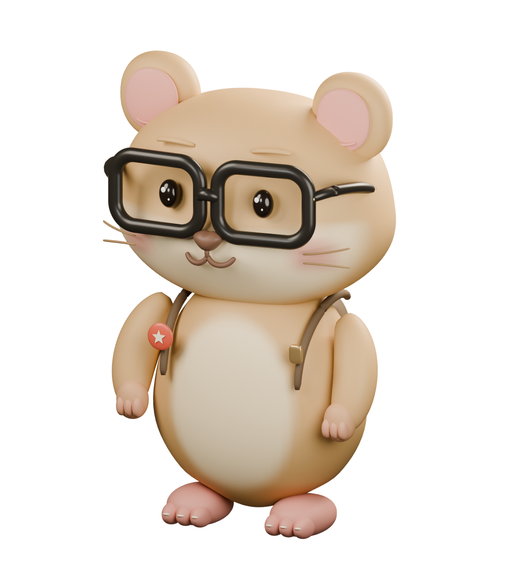

# AI 仓鼠洞 · 3D 探索舱 V2

Alex 大表哥的 AI 新手学习入口。原创眼镜仓鼠站在环形探索舱里，陪访客认识 Alex、选择学习路线，并前往 [AI 仓鼠洞学习站](https://ai.alexdbg.com/)。

[在线体验](https://dikemanarndellst703-star.github.io/sen-3d-resume/) · [在线对比报告](https://dikemanarndellst703-star.github.io/sen-3d-resume/update-report/) · [English](README.en.md) · [本次更新对比报告](docs/redesign-2026-09-08/index.html) · [模型交付说明](docs/redesign-2026-09-08/model-delivery.md)



## V2 体验

- **真实 3D 向导**：重新用 Blender 建模，连续头壳、奶油脸颊、厚镜框、独立眼珠、手爪、背包和学习徽章；眼睛跟随、眨眼、呼吸与轻微转头。
- **可操作的探索舱**：点击角色或「摸摸仓鼠」触发回应与挥手；「转一圈」展示背包；日夜按钮切换页面配色与舱内灯光。
- **原生滚动**：桌面探索舱随首屏和 Alex 介绍保持可见，镜头轻微变化；移动端按自然纵向浏览。
- **清晰的内容入口**：关于 Alex 的五项折叠介绍；AI 入门、AI 绘画、AI 编程、AI 效率四个路线 tab，支持方向键、Home 和 End。
- **渐进加载与回退**：正文和学习入口不等待 3D；Stage 通过 React.lazy 独立加载，GLB 在场景挂载时加载并显示进度。WebGL 不可用或场景失败时显示仓鼠展示图。
- **减少动态效果**：跟随系统 `prefers-reduced-motion`，停止持续角色与装饰动画，旋转按钮改为即时「转身看看」。离开视口或隐藏标签页时暂停 3D 渲染；移动端使用较低像素比。

页面为纯前端 SPA，无后端、数据库或 API key。所有主要学习入口都指向 `https://ai.alexdbg.com/`，在新窗口打开。

## 本地运行与验收

前端应用在 `web/`，npm 命令在该目录执行。Node.js 版本需满足 ESLint 的要求：`^20.19.0 || ^22.13.0 || >=24`；现有 CI 使用 Node.js 20。

```sh
git clone https://github.com/dikemanarndellst703-star/sen-3d-resume.git
cd sen-3d-resume/web
npm ci
npm run dev
```

```sh
npm run typecheck
npm run lint
npm run build
npm run preview
```

开发地址通常为 `http://localhost:5173`。构建输出到 `web/dist/`，请用开发服务器或 `npm run preview` 预览。

视觉验收包含桌面与移动端、角色点击/挥手/转身、日夜灯光、五项折叠、四条路线、键盘导航、系统减少动态偏好，以及 WebGL 回退。模型体积与几何数据见 [验证记录](docs/redesign-2026-09-08/model-asset-verification.json)。

## 修改内容与视觉

以下路径均相对仓库根目录。

| 修改目标 | 文件 |
| --- | --- |
| 首屏、导航、学习站链接、页脚 | `web/src/App.tsx` |
| Alex 的五项介绍 | `web/src/ui/Resume.tsx` 中的 `STORY` |
| 四路线标题、课程列表与外链 | `web/src/data/works.ts` |
| 路线 tab、文案与 CSS 插画结构 | `web/src/ui/Works.tsx` |
| 探索舱按钮、反馈、加载进度、回退与渲染暂停 | `web/src/scene/Stage.tsx` |
| 模型动作、镜头、环形舱、悬浮图标与灯光 | `web/src/scene/Scene.tsx` |
| 日夜、互动次数、展开项与路线状态 | `web/src/store.ts` |
| 颜色、排版、布局、断点与 CSS 动效 | `web/src/styles.css` |
| 品牌规范 | `brand-spec.md` |

当前页面使用代码控制镜头和角色动作，不依赖 GLB 的相机动画或对焦锚点。旧教程在 `tutor/` 保留，涉及原简历模型与相机动画的步骤属于历史架构。

## Blender 源文件与模型约定

- `blender/hamster-v2.blend`：可编辑角色、材质、展示相机与灯光。
- `blender/build_hamster_v2.py`：原创参数化建模、GLB 导出及透明展示图生成脚本。
- `blender/render_model_comparison.py`：用同一灯光与相机生成旧新模型对比图。
- `web/public/models/hamster-v2.glb`：网页使用的角色模型。
- `web/public/brand/hamster-v2-poster.png`：透明展示图与静态回退。

在仓库根目录运行下面命令。示例使用 macOS Blender 路径，可换成自己机器的 Blender 可执行文件；Python 脚本由 Blender 自带的 Python 执行。

```sh
/Applications/Blender.app/Contents/MacOS/Blender --background --python blender/build_hamster_v2.py
/Applications/Blender.app/Contents/MacOS/Blender --background --python blender/render_model_comparison.py
```

GLTF 模型以地面为原点，Y 向上、+Z 朝前，高约 3.59。保留以下命名：

| 节点 | 用途 |
| --- | --- |
| `HamsterRoot` | 角色根节点 |
| `Head` | 脖颈枢轴，眼镜、耳朵与五官随头运动 |
| `Eye_L` / `Eye_R` | 独立眼球；高光为子节点，`scale.y` 可眨眼 |
| `Arm_L` / `Arm_R` | 独立肩部枢轴与手爪，控制挥手 |

新版实测 **93,696 三角面、1,895,128 字节**，文件体积比旧模型减少 **88.2%**。模型无外部纹理依赖，采用 PBR 材质与顶点色。文件大小和三角面减少不代表已测得同等帧率增幅，完整数据见 [模型说明](docs/redesign-2026-09-08/model-delivery.md)。

## 部署与版本留痕

沿用 [GitHub Pages workflow](.github/workflows/deploy.yml)：推送 `main` 或手动触发后，在 `web/` 执行 `npm ci` 和 `npm run build`，上传 `web/dist/` 并部署。仓库 Pages 的构建来源需设置为 GitHub Actions。实际发布结果以 Actions 记录和本次更新报告中的发布记录为准。

Vite 的 `base: './'` 支持子目录部署；运行时素材用 `import.meta.env.BASE_URL` 拼接。`web/dist/` 也可交给其他静态 HTTP 托管服务。

[更新报告](docs/redesign-2026-09-08/index.html) 汇总旧新页面、模型和交互对比；报告目录保留基线截图、演示视频、设计方案、调研、模型统计与验证记录。`blender/sen.blend` 和 `web/public/models/ai-hamster.glb` 均保留，不覆盖旧版本。报告源文件位于 `docs/`；构建脚本将完整对比材料复制到 `web/dist/update-report/`，随同网页发布，可通过站点的 `update-report/` 地址分享。

## 来源、许可与版权

本项目基于 Sen Zheng（SEN）的 [sen-3d-resume](https://github.com/dayinji/sen-3d-resume) 代码二次开发，保留原作者的 [LICENSE](LICENSE) 与 [NOTICE](NOTICE)。代码采用 MIT；原作者的姓名、肖像、模型、简历、作品和品牌素材不在 MIT 授权范围内。

AI 仓鼠洞 / Alex 的品牌、内容、角色模型与展示素材为本项目专用内容，也不因代码采用 MIT 而自动获得复用授权。第三方字体、图像和 HDR 等素材按各自许可处理。复用项目时保留原作者许可声明，并替换或取得所用内容和素材的授权。
