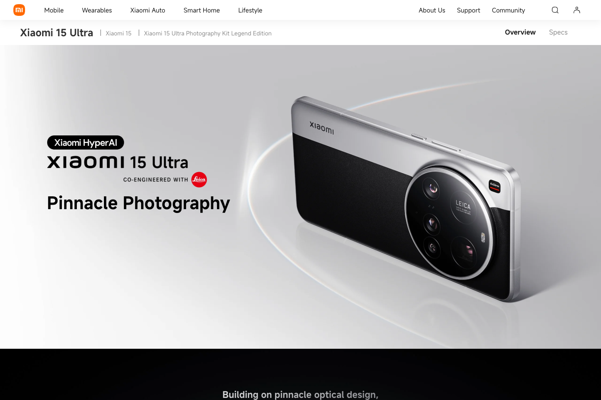
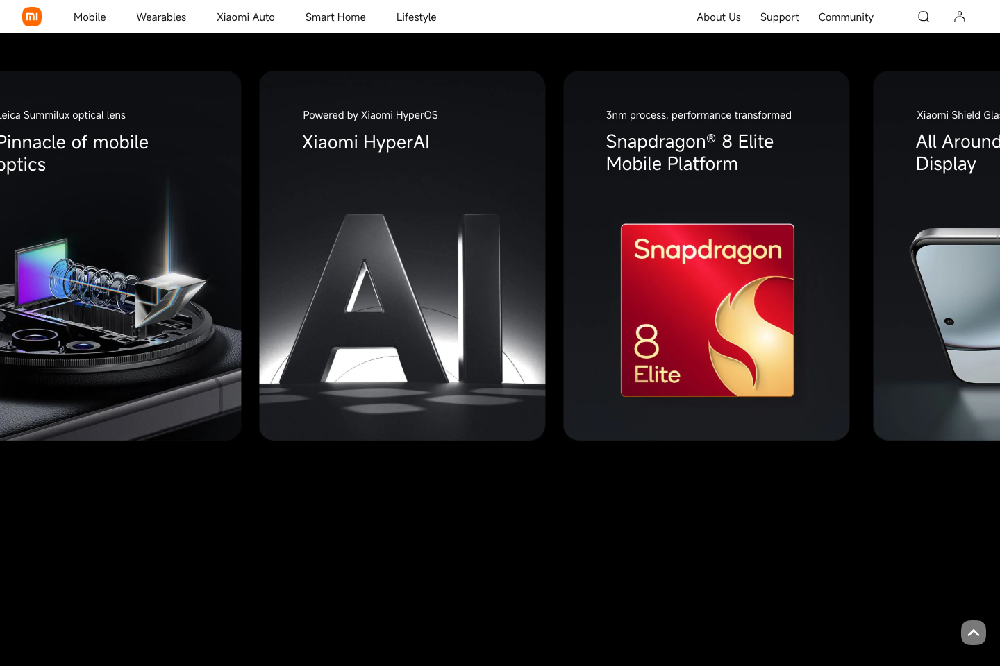
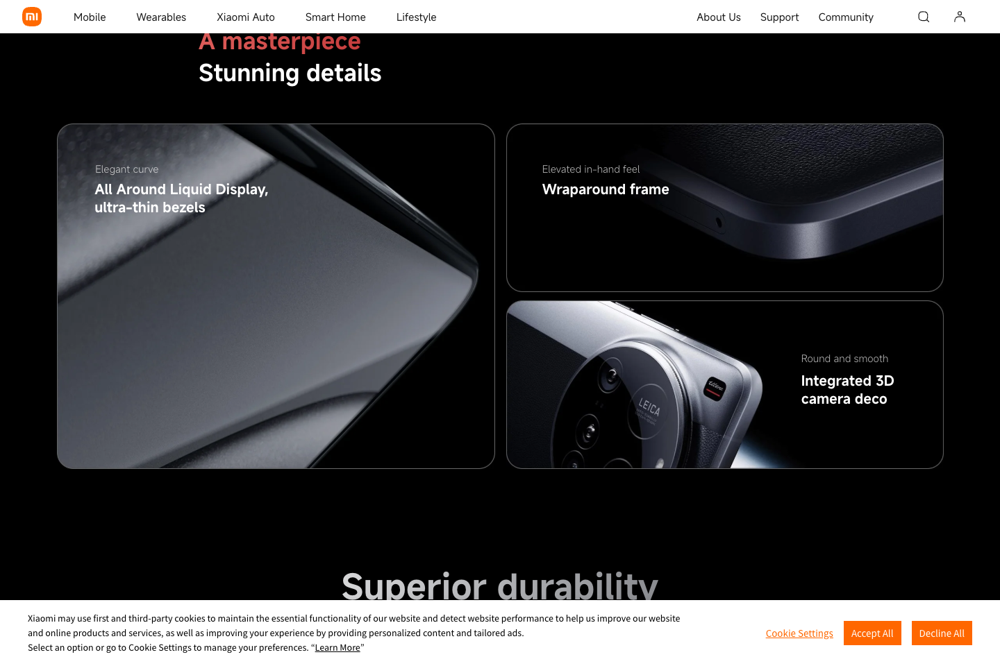
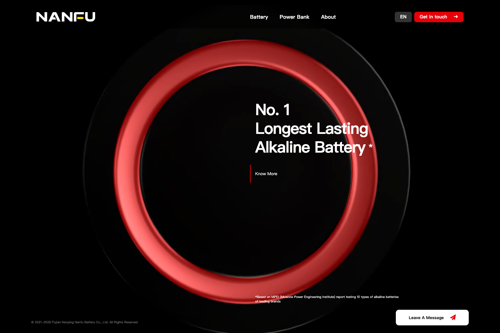
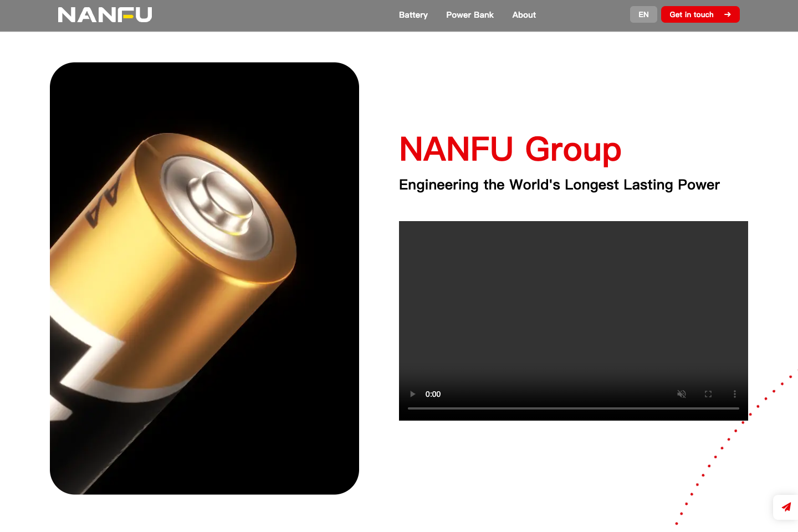
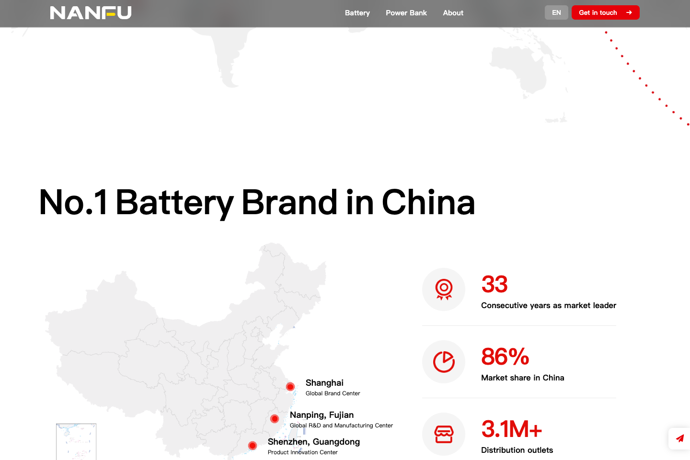

# V3 国际品牌宣传页参考研究

观察日期：2026-09-08。以 1440 × 960、Chrome 152.0.7977.76 的真实网页呈现和原生滚轮为依据。只读访问公开官网，未登录、未提交任何表单。六张截图保留原始网页呈现，仅作设计研究及版本报告中的参考，不作为 AI 仓鼠洞产品素材。

## 官方来源及观察范围

| 来源 | 观察方式 | 使用范围 |
| --- | --- | --- |
| [Xiaomi 15 Ultra 国际产品页](https://www.mi.com/global/product/xiaomi-15-ultra/) | 官网内容核对、真实 Chrome 加载、滚轮序列、截图和 DOM 位置采样 | 首屏构图、固定画面横向滚动、材质特写 |
| [南孚海外官网](https://www.nanfu.global/) | 官网内容核对、真实 Chrome 加载、重复滚轮序列、截图和 DOM 位置采样 | 全屏近景、黑白切换、固定画面叙事、品牌规模章节 |
| [南孚中国官网](https://www.nanfu.com/) | 官网文本和导航核对，确认 EN 链接指向南孚海外站 | 仅作来源确认；未据此断言任何动效 |

## 已观察：小米国际产品页

银白首屏以单一巨大产品和短标题建立视觉中心；下方切入黑底。亮点横向条带由纵向滚动驱动，停留在同一视口高度。后续以设计、影像等章节组织信息，微距展示边框、皮革、镜头等材质。此页实际包含大幅卡片；本项目借鉴它的镜头尺度与滚动组织，而非照搬模块。

可复核证据：第二次采样在 `scrollY = 2300` 和 `3200` 时，`.kvs-slide` 的视口顶部都约为 **85 px**，横向 transform 从 **82.4436 px** 变为 **−514.582 px**。外层 `.kvs_container.pin-spacer` 约 **3074 px** 高。该区存在明确的固定画面和滚动映射，不能等同于普通进场淡入。数据见 [xiaomi-sequence-evidence.json](xiaomi-sequence-evidence.json)。第一轮采样数值因等待时机略有不同，留在 [xiaomi-observed-states.json](xiaomi-observed-states.json)。

## 已观察：南孚海外官网

首屏是黑底聚能环极近景与稀疏白字，主视觉占满视口。向下滚动后，标题退场，画面转成白底的电池产品与企业介绍；再进入巨幅标题、地图和数据段落。黑白背景切换和主视觉尺度变化，共同承担章节转场。

可复核证据：`.banner` 为 **2880 px**，画布为 **960 px** 高。`scrollY = 0 / 672 / 1392` 时画布视口顶部维持 **0 px**；滚至 **2016 px** 时顶部变为 **−96 px**，表明固定区已释放。首屏标题透明度由 **1 → 0**，企业介绍标题由 **0 → 1**。证据见 [nanfu-sequence-evidence.json](nanfu-sequence-evidence.json)。

限制：南孚在本次浏览器中出现部分图片序列的 `drawImage` 加载错误，视频区域也有未播放的状态。因此，已观察的是上述真实分镜和位置变化；不声称完整序列每帧无缝，不推定其底层必然是真实 WebGL 3D。截图保留加载时的实际结果。原生滚轮输入被该站平滑滚动逻辑重新映射，指定输入量不等于最终 `scrollY`，报告使用实际测量值。

## 对 AI 仓鼠洞 V3 的设计推导

以下为基于用户目标与参考观察制定的原创方案，不是对参考站实现的事实断言。保留 AI 仓鼠洞、Alex 和 `https://ai.alexdbg.com/` 的既有品牌与主入口。

### 页面应当像一场角色发布，而非互动控件集合

主舞台贯穿 3–5 个视口的滚动距离：用户持续向下滚动，角色从全身走向眼镜和面部细节，再拉远转向侧面。画面里的主角始终占据足够大的面积。标题与镜头共用一条进度，单个阶段只留下一个主张。学习内容放在舞台后的宽幅章节，信息浏览节奏与镜头节奏区分开。

| 章节 | 画面与镜头 | 文案位置与滚动响应 | 本项目意义 |
| --- | --- | --- | --- |
| 01 / Meet your curiosity | 银白或暖灰工作室，全身 3/4 视角；角色约占视口高 65–80% | 巨幅中文标题，英文辅助字；向下滚动提示 | 第一眼建立 AI 仓鼠洞角色记忆 |
| 02 / Look closer | 同一相机连续向眼镜、眼睛、毛发近景推进；背景渐转石墨黑 | 前一标题先退场，再出现细节主张；模型与文字错开 | 百万面建模必须在真实近景中看得见 |
| 03 / Make it real | 相机侧移、环绕约 30–70°，展示镜腿、耳部、背带和衣物结构 | 大标题和一段短说明；滚动可逆 | 将“探索 AI”转为有手感的视觉体验 |
| 04 / Your next chapter | 镜头拉回全身，主角移向一侧，背景回到浅色 | 清楚展示 Alex 的真实经历与学习路径 | 从品牌印象顺畅接到信任与行动 |
| 05 / Start exploring | 释放固定舞台，正常文档滚动 | 全宽学习路线、清晰主 CTA | 让用户快速前往现有学习站 |

### 交互实现建议

- 使用原生页面滚动作为唯一进度来源；视觉相机做阻尼插值。轮盘、触屏、键盘、滚动条拖动和反向滚动都应得到同一位置的同一镜头。
- 舞台内仅保留一次轻微指针视差或可选拖动观察。滚动主线不依赖“摸摸、转圈、日夜”按钮；避免多套动画争夺相机。
- 章节之间采用“上一句先退场 → 镜头到位 → 下一句出现”的留白，避免多段文字叠在角色脸上。滚动暂停时，必须有可读的稳定构图。
- 固定导航保持精简，主 CTA 始终明确。进度可以用细线或 01–04 的小编号表达，避免软件面板感。
- 手机重新取景和排字：标题放上半部，角色主要占中下部；不直接缩小桌面 16:9 构图。减少或缩短固定区，确保一段文字不用多次滑动才能读完。
- 开启系统减少动态效果时，使用稳定分镜与普通滚动；所有内容和 CTA 仍可访问。WebGL 失效时提供实际角色海报，避免空屏。

### 建模与画面应同时升级

百万面几何要分配在可见的曲率、轮廓和结构：圆润面部、耳廓、鼻翼、眼镜镜圈与镜腿、衣物接缝、手脚连接、毛束层次。纯粹对旧球体重复细分不会自动产生更丰富的造型。公开报告应同时列出 Blender 多边形与导出三角形的实际统计，并明确生产页面加载的模型文件。配合接触阴影、柔和大面积反射、深浅背景中的轮廓光和有节制的粗糙度差异，保证百万面在近景中形成可展示的价值。

## 本轮留痕文件

- 六张原始截图：本目录 `xiaomi-*.png` 与 `nanfu-*.png`。
- 两次观察数据：`*-observed-states.json`、`*-sequence-evidence.json`。仅保留相关元素、原始测量值和错误摘要。
- 可复跑采集脚本：[inspect-reference.cjs](inspect-reference.cjs)、[capture-reference-sequence.cjs](capture-reference-sequence.cjs)。脚本默认使用本机 Chrome 和 Codex bundled Playwright；不读取个人浏览器资料。

参考截图保留第三方商标与设计，仅用于注明来源的研究记录。最终网页应使用本项目自己的 Blender 模型、字体与文字，不直接搬运参考站图片、影片或源代码。
